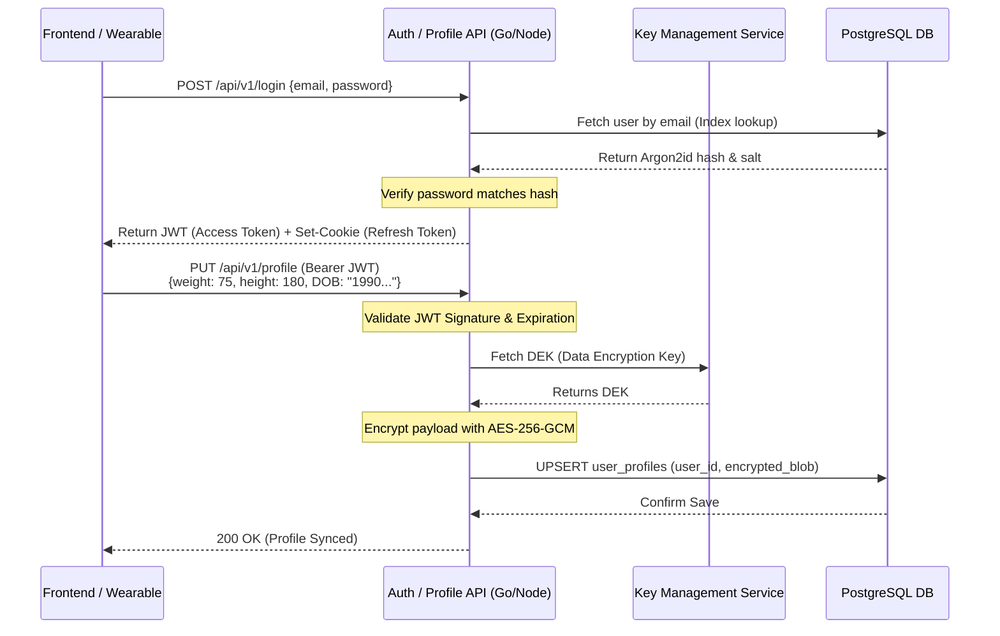

This document serves as the foundational architecture for securely onboarding users, managing JWT authentication, and ingesting static/demographic profile data from wearable devices.

---

# 📄 Product Requirements Document (PRD) & Tech Spec
**Title:** Secure IAM (Auth) & Encrypted Wearable Profile Sync  
**Author:** [Your Name/Title, Senior SDE]  
**Status:** In Review  
**Date:** March 12, 2026  
**Target Delivery:** Q3 2026  

## 1. Executive Summary
**Objective:** Develop an end-to-end frontend authentication flow and a robust backend API to handle user registration, secure login, and JWT-based session management. Additionally, build a profile ingestion endpoint designed to receive static user metrics from wearable devices (e.g., age, weight, height, resting basal metabolic rate) and encrypt them using Application-Level Encryption (ALE) before storing them in the relational database.

**Business Value:**
* Secures the front door of the application, laying the groundwork for real-time telemetry pipelines.
* Eliminates the risk of plain-text PII (Personally Identifiable Information) exposure during database breaches.
* Establishes a seamless, low-friction UX on the frontend while enforcing zero-trust, stateless authentication on the backend.

## 2. Scope & Definitions
### 2.1 In Scope
* **Frontend:** Registration and Login UI components (React / React Native), input validation, and secure client-side session state management.
* **Authentication Service:** REST endpoints for Signup, Login, and Token Refresh using JWT (JSON Web Tokens).
* **Profile Sync API:** A protected backend endpoint to sync wearable demographic data.
* **Cryptography:** Integration with Argon2id for password hashing; Envelope Encryption (via AWS KMS / HashiCorp Vault) for protecting demographic profile payloads.
* **Database:** RDBMS (PostgreSQL) tables for user identities and encrypted profiles.

### 2.2 Out of Scope
* Third-party OAuth (Social Login: Google/Apple) — deferred to V2.
* Over-The-Air (OTA) wearable firmware updates.
* Email validation workflows and "Forgot Password" mechanics (covered under a separate Identity management ticket).

---

## 3. User & System Stories
* **As a New User**, I want to create an account with a strong password so that I can link my wearable device to a secure digital identity.
* **As a Mobile/Web Client**, I want to receive and seamlessly manage short-lived access tokens and long-lived refresh tokens to keep the user logged in without repeated prompts.
* **As a Wearable Device**, I need to sync updated basal demographics (e.g., user updated weight on the scale) to the cloud to ensure fitness algorithms are accurate.
* **As a Security & Compliance Engineer**, I require that an attacker dumping our PostgreSQL database sees only indistinguishable ciphertexts for demographic data and unbreakable hashes for passwords.

---

## 4. Technical Architecture & Data Flow

### 4.1 System Architecture
The system employs a Backend-For-Frontend (BFF) approach for web clients and direct REST APIs for mobile native clients. 

* **Auth Mechanics:** 
  * Passwords are hashed iteratively using **Argon2id**.
  * On success, backend issues a short-lived **Access Token (15 min)** and a long-lived **Refresh Token (7 days)**. 
  * Mobile apps store tokens in iOS Keychain / Android Keystore. Web apps receive Refresh Tokens as `HttpOnly, Secure, SameSite=Strict` cookies to mitigate XSS and CSRF attacks.
* **Profile Mechanics:** 
  * Client sends JSON profile payloads over HTTPS using the Access Token.
  * Backend uses an Application-Level Crypto Module to fetch a Data Encryption Key (DEK), encrypts the data (AES-256-GCM), and commits to Postgres.

### 4.2 Sequence Diagram (Login & Profile Sync)


---

## 5. Functional & Technical Requirements

### 5.1 API Contracts

**1. `POST /api/v1/auth/register`**
* **Request Body:** `{ "email": "user@ex.com", "password": "ComplexPassword123!" }`
* **Response:** `201 Created` 
* *Constraint:* API must strictly enforce rate limiting (e.g., 5 attempts/IP/hour) to prevent credential stuffing and bot registrations.

**2. `POST /api/v1/auth/login`**
* **Response:** `200 OK`
* **Headers:** `Set-Cookie: refreshToken=ey...; HttpOnly; Secure; SameSite=Strict; Max-Age=604800`
* **Body:** `{ "access_token": "ey...", "expires_in": 900 }`

**3. `PUT /api/v1/profile`** (Requires `Authorization: Bearer <token>`)
* **Request Body (Plaintext - from Wearable):**
```json
{
  "device_mac": "00:1A:2B:3C:4D:5E",
  "firmware_version": "v2.4.1",
  "demographics": {
    "birth_year": 1990,
    "weight_kg": 75.5,
    "height_cm": 182
  }
}
```

### 5.2 Cryptography & Data Storage Schema

#### Database Schema (`users` table)
| Column Name   | Data Type | Constraints             | Notes |
|---------------|-----------|-------------------------|-------|
| `user_id`     | UUID      | PK, NOT NULL            | Auto-generated UUIDv4 |
| `email_hash`  | VARCHAR   | UNIQUE, NOT NULL        | Deterministically hashed (HMAC-SHA256) for lookups without exposing plain-text email. |
| `email_enc`   | VARCHAR   | NOT NULL                | Randomized AES-GCM encrypted email for app display |
| `password`    | VARCHAR   | NOT NULL                | Argon2id hash |

#### Database Schema (`user_profiles` table)
| Column Name        | Data Type | Constraints       | Notes |
|--------------------|-----------|-------------------|-------|
| `user_id`          | UUID      | PK, FK (`users`)  | Identifies profile owner |
| `profile_enc_data` | BYTEA     | NOT NULL          | AES-256-GCM cipher payload of the wearable demographics |
| `key_id`           | VARCHAR   | NOT NULL          | Identifier pointing to the specific KMS key used for DEK decryption |
| `updated_at`       | TIMESTAMP | NOT NULL          | Used for sync conflict resolution |

### 5.3 JWT Specification
We will use **Asymmetric Signatures (RS256 or EdDSA)** so that downstream services (like the previously architected WebSocket Ingestion server) can independently verify token validity by caching the API's public key, preventing authentication bottlenecks.

**Payload:**
```json
{
  "sub": "user-uuid-1234",
  "roles":["user"],
  "iat": 1710228000,
  "exp": 1710228900,
  "iss": "api.company.com"
}
```

---

## 6. Frontend Specifics (React / Mobile)

### 6.1 State Management & Token Lifecycle
1. **In-Memory Storage:** The `access_token` MUST NOT be stored in `localStorage` or `sessionStorage` in web browsers due to XSS vulnerabilities. It will be kept in a transient memory variable (React State / Context). 
2. **Axios/Fetch Interceptor:** The client HTTP layer intercepts `401 Unauthorized` responses. Upon a `401`, it temporarily pauses the request queue, makes a silent call to `POST /api/v1/auth/refresh` (passing the HttpOnly refresh cookie automatically), gets a new access token, updates memory, and resumes the paused requests.
3. **Optimistic Syncing:** If the user steps on a smart scale, the UI updates optimistically while making the `PUT /api/v1/profile` network request in the background.

### 6.2 Forms & Validation
* Client-side validation using Zod/Yup (matching backend rules): Passwords must be > 10 characters, include a mix of uppercase/lowercase, and check against common dictionary lists via a localized library like `zxcvbn`.

---

## 7. Edge Cases & Error Handling

| Scenario | Handling Strategy | Justification (SDE Note) |
| :--- | :--- | :--- |
| **Concurrent Profile Syncs** (User updates app + Wearable syncs simultaneously) | Use `updated_at` timestamps or implement an Entity Tag (ETag) via Optimistic Locking (`If-Match` headers). | Ensures the backend doesn't overwrite new data with stale network-delayed packets. |
| **Compromised Refresh Token** | Maintain a Redis "Refresh Token Blocklist" for tokens explicitly revoked via password changes or "Log out of all devices". | Since JWTs are stateless, we must rely on stateful revocation strictly at the refresh boundary to kill active malicious sessions. |
| **KMS Throttling on Mass Sync** | Decouple sync endpoint via Kafka if necessary, but realistically `user_profiles` updates are rare (daily max). Fall back to 503 if KMS times out. | Profile updates aren't critical like heart-rate. A transient fail with client retry is acceptable. |

---

## 8. Observability & Telemetry

* **Audit Logging:** Every successful and failed authentication attempt MUST be logged into ELK/Datadog with contextual data (`ip_address`, `user_agent`). Raw emails/passwords must NEVER be logged.
* **Alerting Metrics:**
  * Spike in `HTTP 401s / 403s` -> Potential credential stuffing attack. Trigger automated IP throttling (Cloudflare WAF).
  * Backend API route latency on `/api/v1/profile` > `200ms` -> Points to database contention or KMS fetch latency.
* **Tracing:** Propagate `traceparent` headers from frontend API calls directly through the Backend router, KMS module, and Postgres queries.

---

## 9. Rollout Strategy & Deployment

1. **Security Audit & Penetration Testing:** Prior to launch, a 3rd-party Infosec firm must review the JWT validation logic and the KMS Envelope Encryption module for cryptographic flaws.
2. **Dark Release:** Deploy the new `/api/v1/profile` endpoint into production behind a feature flag. Perform synthetic tests mapping shadow accounts to verify payload size limits and database row serialization speed.
3. **Phased UI Release (Web First):** Deploy React login components behind feature flag or opt-in Beta flow for internal testing. Wait 1 week for bug detection before enabling on Mobile native apps (which have longer app-store update cycles).
4. **Deprecation:** Issue strict deprecation warnings to any older, non-JWT endpoints or plaintext legacy sync handlers, ensuring backwards-compatible endpoints force a logout within 30 days.