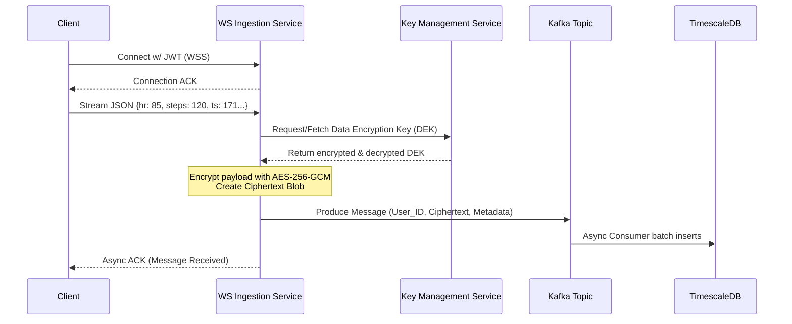

This document blends standard product requirements with architectural constraints, security mandates, and high-level technical design, ensuring a seamless transition from requirement gathering to implementation.

---

# 📄 Product Requirements Document (PRD) & Tech Spec

**Title:** Real-Time Encrypted Health Telemetry Ingestion Pipeline  
**Author:** [Group 15/Title, Senior SDE]  
**Status:** In Review  
**Date:** March 12, 2026  
**Target Delivery:** Q2 2026

## 1. Executive Summary

**Objective:** Build a highly scalable, real-time data ingestion pipeline using WebSockets to collect biometric telemetry (heart rate, steps) from client devices (wearables, mobile apps). To comply with stringent healthcare data regulations (HIPAA/GDPR), the system must enforce Application-Level Encryption (ALE) on all health payloads prior to persistent database insertion.

**Business Value:**

- Enables real-time coaching, dashboarding, and alerts for end-users.
- Protects sensitive Protected Health Information (PHI) through strict encryption-in-transit and encryption-in-use methodologies, minimizing data breach blast radiuses.

## 2. Scope & Definitions

### 2.1 In Scope

- A WebSocket (WS/WSS) endpoint handling concurrent long-lived client connections.
- Real-time parsing of Heart Rate (BPM) and Step Count data.
- Integration with a Key Management Service (KMS) for envelope encryption.
- Application-Level Encryption (ALE) of the payload before database ingestion.
- High-write-throughput Time-Series Database (TSDB) schema design.

### 2.2 Out of Scope

- Analytics dashboards / Frontend UI implementation.
- Historical data aggregations (batch processing).
- Alerting logic (e.g., detecting irregular heartbeats)—though the architecture will support future event streaming for this.

---

## 3. User & System Stories

- **As a Wearable Device/App**, I want to establish a persistent WebSocket connection so I can stream biometric data continuously without the overhead of HTTP connection tear-downs.
- **As an App Developer**, I want clear acknowledgement (ACK) of my transmitted data or graceful error handling if transmission fails.
- **As a Security & Compliance Officer**, I require that no plain-text heart rate or step data is ever written to disk or the database to ensure HIPAA compliance.
- **As an SRE**, I need visibility into WebSocket connection drops, latency, encryption failures, and database insertion bottlenecks.

---

## 4. Technical Architecture & Data Flow

### 4.1 High-Level Flow (System Architecture)

1. **Client** opens a Secure WebSocket (`WSS://`) connection via an API Gateway / Load Balancer.
2. The **Telemetry Ingestion Service (Go/Node.js/Rust)** handles the connection, authenticates the client via JWT, and keeps the socket alive.
3. The Client streams JSON payloads (`heart_rate`, `steps`, `timestamp`).
4. The Service invokes a **Crypto Module**, fetching a Data Encryption Key (DEK) via Envelope Encryption from the **AWS KMS / HashiCorp Vault**.
5. The Service encrypts the sensitive metric data (AES-256-GCM).
6. The Service publishes the encrypted record to an asynchronous buffer (**Apache Kafka / AWS Kinesis**) to decouple ingestion from storage and handle massive burst traffic.
7. A **Consumer / DB Writer** pulls from the buffer and batch-inserts records into a **Time-Series Database** (e.g., PostgreSQL with TimescaleDB).

### 4.2 Sequence Diagram



---

## 5. Functional & Technical Requirements

### 5.1 Connection & Authentication

- **Endpoint:** `wss://api.company.com/v1/telemetry/stream`
- **Auth:** Due to WebSocket API limitations in browsers regarding custom headers, authentication will be handled via a primary `auth` frame sent within 3 seconds of connection establishment. If no valid JWT is sent, the server violently drops the connection (Status Code `4003 Not Authorized`).
- **Heartbeat:** Server requires Ping/Pong frames every 30 seconds to cull dead connections and free up file descriptors.

### 5.2 Payload Specifications

Clients will transmit data using lightweight JSON frames.

**Client Request Message (Plaintext - in memory only):**

```json
{
  "type": "telemetry",
  "data": {
    "timestamp": "2026-03-12T06:47:00Z",
    "device_id": "apple_watch_v8",
    "heart_rate": 82,
    "steps": 14
  }
}
```

**Server Response (ACK):**

```json
{
  "type": "ack",
  "status": "success",
  "timestamp": "2026-03-12T06:47:00Z"
}
```

### 5.3 Encryption Specifications (Security)

To protect health data at rest beyond basic Transparent Data Encryption (TDE), we will use **Envelope Encryption**:

1. **Algorithm:** AES-256-GCM (Authenticated Encryption).
2. **Key Rotation:** A master Customer Master Key (CMK) in AWS KMS will rotate yearly. Data Encryption Keys (DEKs) will be generated uniquely per user or cached daily.
3. **Encrypted Payload Shape:** Only the sensitive PHI is encrypted. Routing metadata (`user_id`, `device_id`, `timestamp`) remains plaintext so the DB can index and partition queries efficiently.

**Pre-Database Payload Structure:**

```json
{
  "user_id": "usr_99213A",
  "timestamp": "2026-03-12T06:47:00Z",
  "enc_payload": "v2.local.xyA12Z...[base64-encoded-ciphertext-and-auth-tag]...",
  "dek_reference": "kms-key-id-1234"
}
```

### 5.4 Database Storage (TimescaleDB / PostgreSQL)

Data will be inserted into a hypertable. We prioritize fast writes and partitioning by `time` and `user_id`.

**Schema Design (`health_telemetry` table):**
| Column Name | Data Type | Constraints | Notes |
|---------------|-----------|-------------------------|-------|
| `time` | TIMESTAMPTZ | NOT NULL, Primary Key | Hypertable dimension |
| `user_id` | UUID | NOT NULL, Primary Key | Indexed for querying |
| `device_id` | VARCHAR | NULL | |
| `encrypted_data`| BYTEA / TEXT | NOT NULL | The AES-256-GCM cipher payload |
| `key_id` | VARCHAR | NOT NULL | Identifier to decrypt |

---

## 6. Non-Functional Requirements (NFRs)

### 6.1 Performance & Scalability

- **Connections:** The WS Gateway must support up to 500,000 concurrent active connections.
- **Throughput:** System must handle an average of 1 payload/minute per user (8,333 inserts/second across the cluster).
- **Decoupling:** Direct-to-DB writes will bottleneck. WebSocket layer _must_ push to a Kafka topic. DB consumers pull from Kafka in configurable batches (e.g., 500 rows/batch).

### 6.2 Latency Constraints

- Time from WebSocket ingestion to Kafka ACKing must be `< 50ms` (P95).
- KMS retrieval will add latency. We must securely cache the user's daily DEK in memory (Redis/local LRU) for a maximum of 24 hours to avoid a network call to AWS KMS for every single heart-rate pulse.

### 6.3 Reliability & Resilience

- **Backpressure Handling:** If Kafka goes down or slows down, the WS service should queue locally up to a memory threshold, then apply backpressure to clients (sending `"type": "rate_limited"` or slowing down socket reads).
- **Retry Mechanism:** End-client SDKs should implement exponential backoff if the WS connection disconnects.

---

## 7. Edge Cases & Error Handling

| Scenario                       | System Behavior                                                                                 | SDE Note                                                           |
| :----------------------------- | :---------------------------------------------------------------------------------------------- | :----------------------------------------------------------------- |
| **Malformed JSON Received**    | Return standard error format payload, increment malformed metric, drop frame.                   | Do NOT close socket, user's network may have clipped a frame.      |
| **KMS is Down / Timeout**      | Circuit break after 3 fails. Disconnect WS connection. Return error code `1011` (Server Error). | System cannot legally persist unencrypted data. Must fail fast.    |
| **Spike in Message Frequency** | Token Bucket Rate Limiting per WebSocket connection (Max 1 msg / sec).                          | Warn user (`"error": "rate_limit_exceeded"`), drop excess packets. |
| **Clock Drift on Client**      | Reject messages where `timestamp` is >24hrs in the past or >5 minutes in the future.            | Ensures TSDB chunking efficiency is preserved.                     |

---

## 8. Observability & Telemetry

Implementation must include comprehensive Prometheus metrics and structured JSON logging (ELK/Datadog):

**Key Metrics to Dashboard:**

- `ws_active_connections` (Gauge)
- `ws_messages_received_total` (Counter, partitioned by success/error/rate_limited)
- `crypto_encryption_duration_ms` (Histogram - to track encryption overhead)
- `db_batch_insert_duration_ms` (Histogram)
- `kafka_consumer_lag` (Gauge)

**Tracing:**
Propagate OpenTelemetry trace IDs. A trace ID should be created when the WS frame is parsed and passed to the logger, Kafka headers, and DB insertion logs to allow end-to-end debugging of a single data point.

---

## 9. Rollout Strategy

- **Phase 1: Proof of Concept & Load Testing.** Deploy to staging with dummy client data generating 100k connections. Monitor memory footprint of the WebSocket server (to fine-tune garbage collection and OS TCP limits like `fs.file-max`).
- **Phase 2: Internal Alpha (App Employees only).** Point employee wearable apps to the new ingestion pipeline. Validate decryption dashboard tools.
- **Phase 3: Dark Launch.** Push 5% of production wearable telemetry through the WS pipeline, but don't read from the DB for primary apps. Verify no data drift.
- **Phase 4: General Availability (100% Rollout).** Enable for all end users. Retire the legacy polling/REST API over a 60-day deprecation window.
